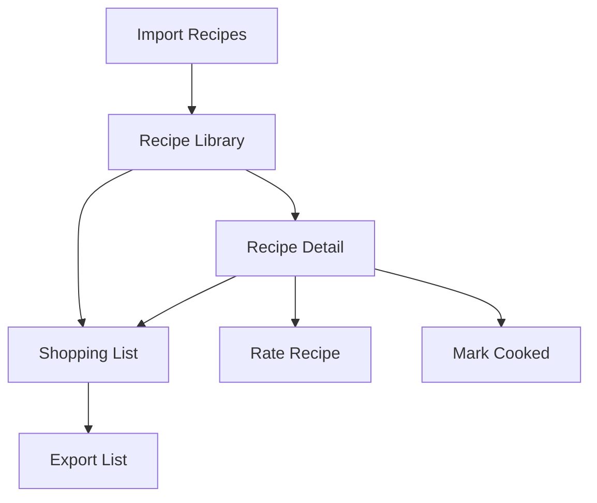

## 1. Product Overview
A personal digital cookbook web application that transforms unstructured recipe text files into an organized, searchable recipe library. The app helps home cooks manage their recipes with categorization, rating system, ingredient scaling, and shopping list generation for efficient meal planning and cooking.

Target users: Home cooks who want to organize their recipe collections and streamline their cooking process with smart features like ingredient scaling and shopping lists.

## 2. Core Features

### 2.1 User Roles
| Role | Registration Method | Core Permissions |
|------|---------------------|------------------|
| Personal User | Email registration | Full access to all features, private recipe collection |

### 2.2 Feature Module
The personal cookbook consists of the following main pages:
1. **Recipe Library**: Browse all recipes with filtering and sorting options
2. **Recipe Detail**: View full recipe with ingredients, steps, notes, and scaling calculator
3. **Shopping List**: Combined ingredient list from selected recipes
4. **Import Recipes**: Upload and parse unstructured recipe text files

### 2.3 Page Details
| Page Name | Module Name | Feature description |
|-----------|-------------|---------------------|
| Recipe Library | Recipe Grid | Display recipes in card format with title, category, rating, and cooked status |
| Recipe Library | Filter Bar | Filter by category (Soup, Side, Main, Dessert), rating (1-5 stars), cooked status |
| Recipe Library | Sort Options | Sort by rating, name, category, or cooked date |
| Recipe Library | Search | Search recipes by title or ingredients |
| Recipe Detail | Recipe Header | Show title, category, servings, rating, cooked status |
| Recipe Detail | Ingredients List | Display ingredients with amounts, scale to 1 serving by default |
| Recipe Detail | Scaling Calculator | Adjust servings and automatically recalculate ingredient amounts |
| Recipe Detail | Cooking Steps | Show numbered preparation and cooking instructions |
| Recipe Detail | Notes Section | Display recipe notes and personal comments |
| Recipe Detail | Action Buttons | Mark as cooked, rate recipe (1-5 stars), add to shopping list |
| Shopping List | Recipe Selection | Multi-select recipes to combine ingredients |
| Shopping List | Ingredient List | Show combined ingredients sorted alphabetically with total amounts |
| Shopping List | Export Options | Print or copy shopping list |
| Import Recipes | File Upload | Upload text files containing unstructured recipe data |
| Import Recipes | Auto Parser | Automatically extract title, ingredients, steps, notes, and servings |
| Import Recipes | Manual Review | Edit parsed data before saving to library |

## 3. Core Process
**Main User Flow:**
1. User uploads unstructured recipe text file → System parses and categorizes recipes → User reviews and saves to library
2. User browses recipe library → Filters by category/rating → Selects recipe → Views details with scaled ingredients → Cooks recipe → Rates and marks as cooked
3. User selects multiple recipes → Generates combined shopping list → Exports for grocery shopping

## 4. User Interface Design

### 4.1 Design Style
- **Primary Colors**: Warm orange (#FF6B35) for primary actions, soft cream (#FFF8F3) for backgrounds
- **Secondary Colors**: Fresh green (#4CAF50) for cooked status, gray (#757575) for neutral elements
- **Button Style**: Rounded corners with subtle shadows, hover effects for interactivity
- **Typography**: Clean sans-serif font (Inter), 16px base size, clear hierarchy with bold headers
- **Icon Style**: Minimal line icons for categories, star ratings, and actions
- **Layout**: Card-based design with responsive grid, consistent spacing with 8px grid system

### 4.2 Page Design Overview
| Page Name | Module Name | UI Elements |
|-----------|-------------|-------------|
| Recipe Library | Recipe Grid | 3-column responsive grid on desktop, 1-column on mobile. Recipe cards with image placeholder, title, category badge, star rating, cooked indicator |
| Recipe Library | Filter Bar | Horizontal filter pills for categories, star rating filter with clickable stars, toggle for cooked/uncooked status |
| Recipe Detail | Recipe Header | Full-width hero section with recipe title, category tag, serving size, rating stars, cooked date if applicable |
| Recipe Detail | Ingredients List | Clean list with bullet points, ingredient amounts prominently displayed, scaling calculator as sticky sidebar |
| Recipe Detail | Scaling Calculator | Number input for servings, real-time ingredient recalculation, reset to original button |
| Shopping List | Recipe Selection | Multi-select checkboxes on recipe cards, selected count indicator, generate list button |
| Shopping List | Ingredient List | Alphabetical grouping, ingredient amounts with units, clear section headers, print-friendly layout |

### 4.3 Responsiveness
Desktop-first design approach with mobile adaptation. Touch-optimized interactions for mobile devices including swipe gestures for recipe cards and large touch targets for buttons and filters.

### 4.4 Visual Enhancements
- Smooth transitions between pages and filter changes
- Loading skeletons for recipe cards during data fetching
- Success toasts for actions like rating recipes or generating shopping lists
- Empty states with helpful messages and action prompts