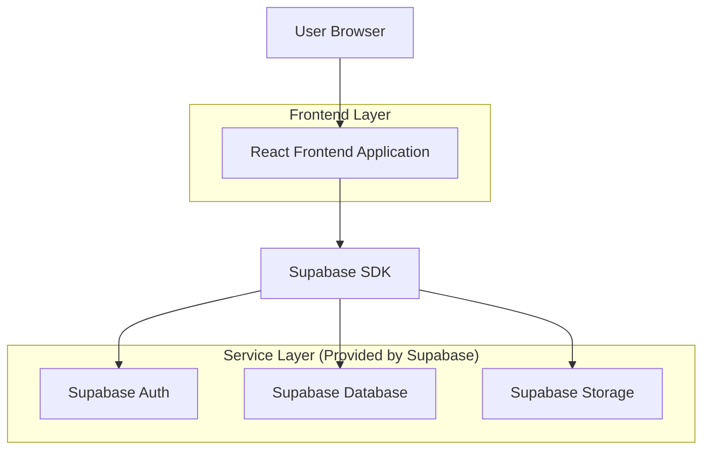
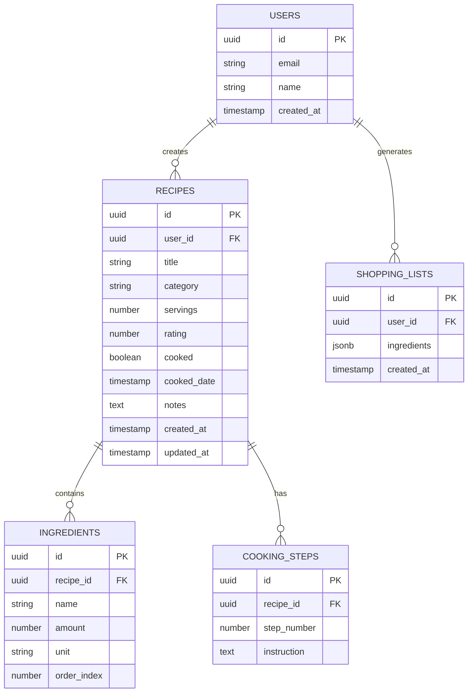

## 1. Architecture design



## 2. Technology Description
- Frontend: React@18 + tailwindcss@3 + vite
- Initialization Tool: vite-init
- Backend: Supabase (Authentication, Database, Storage)
- State Management: React Context API + useState/useEffect
- Recipe Parsing: Custom text parsing logic with regex patterns

## 3. Route definitions
| Route | Purpose |
|-------|---------|
| / | Recipe Library - Main dashboard with all recipes |
| /recipe/:id | Recipe Detail - Individual recipe view with scaling calculator |
| /shopping-list | Shopping List - Combined ingredients from selected recipes |
| /import | Import Recipes - Upload and parse recipe text files |
| /login | Login - User authentication |
| /profile | Profile - User settings and preferences |

## 4. API definitions

### 4.1 Core API

**Recipe Management**
```
GET /api/recipes
POST /api/recipes
PUT /api/recipes/:id
DELETE /api/recipes/:id
```

**Recipe List Request:**
| Param Name| Param Type  | isRequired  | Description |
|-----------|-------------|-------------|-------------|
| category  | string      | false       | Filter by category (soup, side, main, dessert) |
| rating    | number      | false       | Filter by minimum rating (1-5) |
| cooked    | boolean     | false       | Filter by cooked status |
| search    | string      | false       | Search query for title/ingredients |

**Recipe List Response:**
| Param Name| Param Type  | Description |
|-----------|-------------|-------------|
| id        | string      | Recipe unique identifier |
| title     | string      | Recipe name |
| category  | string      | Recipe category |
| rating    | number      | User rating (1-5) |
| cooked    | boolean     | Whether recipe has been cooked |
| servings  | number      | Original serving size |
| image_url | string      | Recipe image URL |

**Shopping List Generation**
```
POST /api/shopping-list
```

Request:
| Param Name| Param Type  | isRequired  | Description |
|-----------|-------------|-------------|-------------|
| recipe_ids| array       | true        | Array of recipe IDs to combine |

Response:
| Param Name| Param Type  | Description |
|-----------|-------------|-------------|
| ingredients| array      | Combined ingredient list with amounts |

## 5. Server architecture diagram
Not applicable - Using Supabase backend-as-a-service with direct client SDK integration.

## 6. Data model

### 6.1 Data model definition


### 6.2 Data Definition Language

**Users Table**
```sql
-- create table
CREATE TABLE users (
    id UUID PRIMARY KEY DEFAULT gen_random_uuid(),
    email VARCHAR(255) UNIQUE NOT NULL,
    name VARCHAR(100) NOT NULL,
    created_at TIMESTAMP WITH TIME ZONE DEFAULT NOW()
);

-- grant permissions
GRANT SELECT ON users TO anon;
GRANT ALL PRIVILEGES ON users TO authenticated;
```

**Recipes Table**
```sql
-- create table
CREATE TABLE recipes (
    id UUID PRIMARY KEY DEFAULT gen_random_uuid(),
    user_id UUID REFERENCES users(id) ON DELETE CASCADE,
    title VARCHAR(255) NOT NULL,
    category VARCHAR(50) CHECK (category IN ('soup', 'side', 'main', 'dessert')),
    servings INTEGER DEFAULT 4,
    rating INTEGER CHECK (rating >= 1 AND rating <= 5),
    cooked BOOLEAN DEFAULT FALSE,
    cooked_date TIMESTAMP WITH TIME ZONE,
    notes TEXT,
    created_at TIMESTAMP WITH TIME ZONE DEFAULT NOW(),
    updated_at TIMESTAMP WITH TIME ZONE DEFAULT NOW()
);

-- create indexes
CREATE INDEX idx_recipes_user_id ON recipes(user_id);
CREATE INDEX idx_recipes_category ON recipes(category);
CREATE INDEX idx_recipes_rating ON recipes(rating);
CREATE INDEX idx_recipes_cooked ON recipes(cooked);

-- grant permissions
GRANT SELECT ON recipes TO anon;
GRANT ALL PRIVILEGES ON recipes TO authenticated;
```

**Ingredients Table**
```sql
-- create table
CREATE TABLE ingredients (
    id UUID PRIMARY KEY DEFAULT gen_random_uuid(),
    recipe_id UUID REFERENCES recipes(id) ON DELETE CASCADE,
    name VARCHAR(255) NOT NULL,
    amount DECIMAL(10,2) NOT NULL,
    unit VARCHAR(50) NOT NULL,
    order_index INTEGER DEFAULT 0
);

-- create indexes
CREATE INDEX idx_ingredients_recipe_id ON ingredients(recipe_id);

-- grant permissions
GRANT SELECT ON ingredients TO anon;
GRANT ALL PRIVILEGES ON ingredients TO authenticated;
```

**Cooking Steps Table**
```sql
-- create table
CREATE TABLE cooking_steps (
    id UUID PRIMARY KEY DEFAULT gen_random_uuid(),
    recipe_id UUID REFERENCES recipes(id) ON DELETE CASCADE,
    step_number INTEGER NOT NULL,
    instruction TEXT NOT NULL
);

-- create indexes
CREATE INDEX idx_steps_recipe_id ON cooking_steps(recipe_id);
CREATE INDEX idx_steps_number ON cooking_steps(step_number);

-- grant permissions
GRANT SELECT ON cooking_steps TO anon;
GRANT ALL PRIVILEGES ON cooking_steps TO authenticated;
```

**Row Level Security Policies**
```sql
-- Recipes: Users can only see their own recipes
CREATE POLICY "Users can view own recipes" ON recipes
    FOR SELECT USING (auth.uid() = user_id);

CREATE POLICY "Users can insert own recipes" ON recipes
    FOR INSERT WITH CHECK (auth.uid() = user_id);

CREATE POLICY "Users can update own recipes" ON recipes
    FOR UPDATE USING (auth.uid() = user_id);

CREATE POLICY "Users can delete own recipes" ON recipes
    FOR DELETE USING (auth.uid() = user_id);

-- Ingredients: Accessible through recipe ownership
CREATE POLICY "Users can view ingredients for own recipes" ON ingredients
    FOR SELECT USING (
        EXISTS (
            SELECT 1 FROM recipes 
            WHERE recipes.id = ingredients.recipe_id 
            AND recipes.user_id = auth.uid()
        )
    );
```